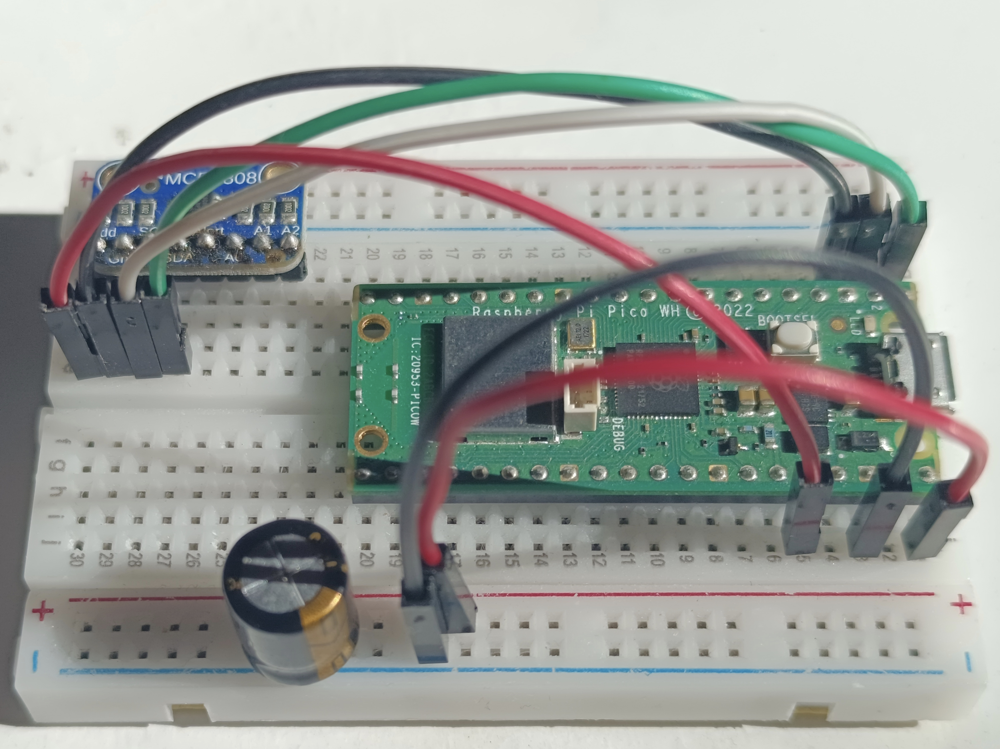

# Raspberry Pi Pico W Thermostat with Luxtronik 2.0

This project involves a [Raspberry Pi Pico W](https://www.raspberrypi.com/documentation/microcontrollers/raspberry-pi-pico.html) that logs temperature data. The data is either sent to a local server for processing, or processed directly on the Pico itself. The processed data is used to adjust a heating offset on a heat pump with a regulator Luxtronik 2.0. Additionally, an email with a graph of the data is sent to the user. Setup with a server results in prettier graphs and an excel spreadsheet being send.

## Installation

### Standalone Raspberry Pi Pico

#### Hardware

The current configuration utilizes [MCP9808](https://www.adafruit.com/product/1782) I2C temperature sensor. Connect it to pi pico according to the instructions below. Additionally, you can add a capacitor for voltage stabilization when using a longer power cable.

You can add support for your own sensor by modifying 'readtemp.py' and 'main.py'.

##### Pin connections

| [MCP9808](https://learn.adafruit.com/adafruit-mcp9808-precision-i2c-temperature-sensor-guide/pinouts "Pinout") | [Pi Pico](https://www.raspberrypi.com/documentation/microcontrollers/raspberry-pi-pico.html#pinout-and-design-files "Pinout") |
| -------------------------------------------------------------------------------------------------------- | ----------------------------------------------------------------------------------------------------------------------- |
| Vdd                                                                                                      | 3V3(OUT) - PIN36                                                                                                        |
| Gnd                                                                                                      | GND - PIN3                                                                                                              |
| SCL                                                                                                      | I2C0 SCL - PIN2                                                                                                         |
| SDA                                                                                                      | I2C0 SDA - PIN1                                                                                                         |

##### Setup example

#### Software

1. Copy the contents of the 'pi-pico + server\pi-pico' folder onto your Raspberry Pi Pico.
2. Copy the contents of the 'pi-pico standalone' folder onto your Raspberry Pi Pico.
3. Fill out the 'configtemplate.json' file with your specific configuration details.
4. Rename 'configtemplate.json' to 'config.json'.

You can use [Thonny](https://thonny.org/) to connect to pi pico.

### Raspberry Pi Pico with Server

#### Hardware

Same as for standalone Raspberry Pi Pico.

#### Software

1. Copy the contents of the 'pi-pico + server\pi-pico' folder onto your Raspberry Pi Pico.
2. Copy the contents of the 'pi-pico + server\server' folder onto your server.
3. Fill out the 'configtemplate.json' file on both devices with your specific configuration details.
4. Rename 'configtemplate.json' on both devices to 'config.json'.

For Linux servers, there is a handy 'install.sh' script for server installation. On other platforms, you need Python3 installed with the required packages. You also need to set 'receiver.py' to auto-start.

## Usage

Once installed, the Raspberry Pi Pico will start logging temperature data and either send it to the local server or process it on the device itself, depending on your setup.

## Contributing

Contributions are welcome. Please open an issue first to discuss what you would like to change.

## License

[GNU GPLv3 ](https://choosealicense.com/licenses/gpl-3.0/)
